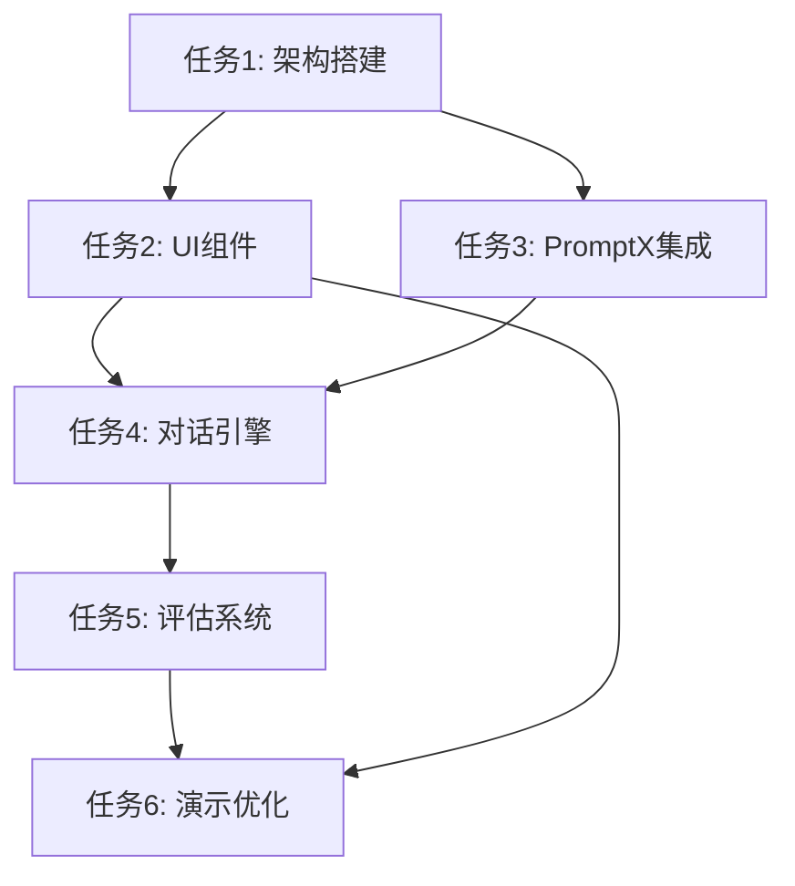

# 🎯 AI HR项目OES任务拆分详细方案

## 📋 任务1: 项目架构设计与环境搭建

### 目标(O)
- 建立基于FoloUp架构优势的简化版技术架构
- 搭建Next.js 14 + TypeScript开发环境
- 配置PromptX MCP集成环境
- 确保30分钟内完成基础环境搭建

### 环境(E)
**信息资源层**：
- FoloUp项目的package.json依赖分析
- Next.js 14官方文档和最佳实践
- PromptX MCP集成文档
- Tailwind CSS配置指南

**约束条件层**：
- 时间限制：20分钟内完成
- 依赖最小化：只安装必要的包
- 本地运行：避免复杂的部署配置
- 兼容性：确保PromptX MCP正常工作

**执行规范层**：
- 使用TypeScript严格模式
- 遵循Next.js App Router结构
- 采用Tailwind CSS原子化样式
- 代码结构清晰，便于快速开发

### 成功标准(S)
- 基础达标：Next.js项目成功启动，PromptX连接正常
- 预期品质：TypeScript配置完整，Tailwind样式生效
- 卓越表现：开发环境响应迅速，热重载正常

---

## 📋 任务2: 核心UI组件开发

### 目标(O)
- 开发四个核心UI组件：岗位输入、面试官生成、对话界面、结果展示
- 借鉴FoloUp的组件化设计理念
- 实现响应式布局和良好的用户体验
- 确保组件可复用和易维护

### 环境(E)
**信息资源层**：
- FoloUp的UI组件设计参考
- Radix UI组件库文档
- Tailwind CSS设计系统
- 现代Web UI设计最佳实践

**约束条件层**：
- 开发时间：15分钟
- 浏览器兼容：现代浏览器
- 响应式：支持桌面和平板
- 无障碍：基本的可访问性支持

**执行规范层**：
- 组件化开发，单一职责原则
- 使用TypeScript接口定义props
- 采用Tailwind CSS进行样式开发
- 组件命名清晰，便于理解

### 成功标准(S)
- 基础达标：四个组件正常渲染，基本交互功能完整
- 预期品质：界面美观，交互流畅，代码结构清晰
- 卓越表现：组件高度可复用，用户体验优秀

---

## 📋 任务3: PromptX集成与AI面试官生成

### 目标(O)
- 集成PromptX女娲角色到项目中
- 实现从岗位描述到AI面试官的生成逻辑
- 生成包含人格、专业背景、问题库的完整面试官
- 确保生成过程在30秒内完成

### 环境(E)
**信息资源层**：
- PromptX MCP API文档
- 女娲角色的能力说明
- AI面试官角色模板
- 岗位描述解析算法

**约束条件层**：
- 生成时间：≤30秒
- 质量要求：面试官专业度高
- 稳定性：生成成功率≥95%
- 可扩展：支持任意岗位类型

**执行规范层**：
- 使用异步处理避免界面阻塞
- 实现错误处理和重试机制
- 缓存常用岗位的面试官模板
- 提供生成进度反馈

### 成功标准(S)
- 基础达标：能够生成基本的AI面试官角色
- 预期品质：面试官专业度高，问题针对性强
- 卓越表现：生成速度快，质量稳定，用户体验佳

---

## 📋 任务4: 智能对话引擎开发

### 目标(O)
- 实现AI面试官与候选人的实时对话功能
- 支持上下文记忆和智能追问
- 实现基本的情感识别和回应
- 确保对话自然流畅

### 环境(E)
**信息资源层**：
- 对话系统设计模式
- 上下文管理最佳实践
- 情感分析技术文档
- 面试对话场景分析

**约束条件层**：
- 响应时间：≤3秒
- 上下文长度：支持10轮对话
- 内存使用：合理控制
- 稳定性：无内存泄漏

**执行规范层**：
- 使用状态管理维护对话历史
- 实现消息队列处理机制
- 添加对话质量评估
- 提供对话导出功能

### 成功标准(S)
- 基础达标：对话功能正常，上下文连贯
- 预期品质：追问智能，情感识别准确
- 卓越表现：对话自然，用户体验优秀

---

## 📋 任务5: 评估分析系统

### 目标(O)
- 开发候选人回答的智能分析和评分系统
- 生成可视化的评估报告
- 提供改进建议和匹配度分析
- 支持多维度评估指标

### 环境(E)
**信息资源层**：
- FoloUp的分析算法参考
- 招聘评估标准文档
- 数据可视化最佳实践
- AI分析技术文档

**约束条件层**：
- 分析时间：≤5秒
- 评估维度：≥5个指标
- 准确性：评估结果合理
- 可解释性：结果可追溯

**执行规范层**：
- 使用标准化评分算法
- 实现多维度权重计算
- 添加可视化图表展示
- 提供详细的评估报告

### 成功标准(S)
- 基础达标：评估功能正常，报告生成成功
- 预期品质：评估准确，可视化清晰
- 卓越表现：分析深入，建议实用

---

## 📋 任务6: 演示数据准备与优化

### 目标(O)
- 准备演示用的示例数据和场景
- 优化界面响应速度和用户体验
- 准备备用方案和演示脚本
- 确保演示效果震撼

### 环境(E)
**信息资源层**：
- 典型岗位需求示例
- 面试对话场景脚本
- 演示最佳实践指南
- 用户体验优化技巧

**约束条件层**：
- 演示时长：15分钟
- 响应速度：≤2秒
- 稳定性：零故障演示
- 备用方案：至少2套

**执行规范层**：
- 准备多个岗位的演示数据
- 优化关键路径的性能
- 实现演示模式切换
- 准备故障恢复方案

### 成功标准(S)
- 基础达标：演示数据完整，系统运行稳定
- 预期品质：演示流畅，效果震撼
- 卓越表现：超出预期，技术创新突出

---

## 🔄 任务依赖关系

## ⏱️ 时间分配建议

| 任务 | 预计时间 | 优先级 | 负责角色 |
|------|----------|--------|----------|
| 任务1 | 15分钟 | 高 | 架构师 |
| 任务2 | 15分钟 | 高 | 前端开发 |
| 任务3 | 15分钟 | 高 | AI工程师 |
| 任务4 | 10分钟 | 中 | 全栈开发 |
| 任务5 | 10分钟 | 中 | 数据分析师 |
| 任务6 | 5分钟 | 低 | 产品经理 |

**总计：70分钟（包含10分钟缓冲时间）**
