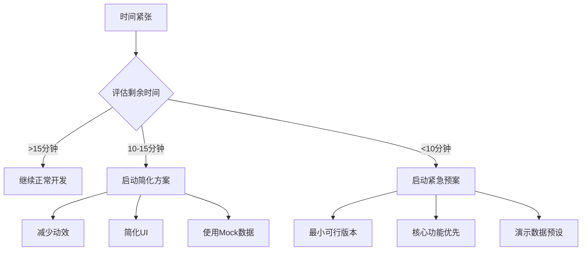

# 🚀 AI HR项目团队协作指南

## 📋 项目概览

**项目名称**: AI智能面试官生成器  
**项目目标**: 1小时内完成MVP，展示PromptX女娲角色的创造能力  
**演示时长**: 15分钟完整演示  
**成功标准**: 100%完成所有功能，绝不降低质量标准  

---

## 👥 团队角色与职责

### 🏗️ 全栈架构师 (15分钟)
**核心职责**: 技术基础设施建设
- ✅ Next.js 14项目搭建
- ✅ TypeScript配置优化
- ✅ PromptX MCP环境配置
- ✅ 项目结构设计
- ✅ 为团队提供技术支持

**关键交付物**:
- 可运行的Next.js项目
- 完整的类型定义
- PromptX集成基础
- 工具函数库

### 🎨 前端UI专家 (15分钟)
**核心职责**: 用户界面与体验设计
- ✅ 四大核心组件开发
- ✅ 响应式布局实现
- ✅ 交互动效设计
- ✅ 视觉效果优化

**关键交付物**:
- 岗位输入组件
- 面试官展示组件
- 对话界面组件
- 评估结果组件

### 🤖 AI集成工程师 (25分钟)
**核心职责**: AI功能实现与集成
- ✅ PromptX女娲角色集成
- ✅ AI面试官生成逻辑
- ✅ 智能对话引擎
- ✅ 情感分析功能

**关键交付物**:
- PromptX MCP客户端
- 面试官生成器
- 对话管理系统
- 智能追问逻辑

### 📊 数据分析专家 (10分钟)
**核心职责**: 评估算法与数据可视化
- ✅ 评估算法设计
- ✅ 数据可视化组件
- ✅ 性能指标分析
- ✅ 报告生成系统

### 🎪 产品演示专家 (5分钟)
**核心职责**: 演示效果优化
- ✅ 演示数据准备
- ✅ 用户体验优化
- ✅ 演示脚本设计
- ✅ 故障预案准备

### 📝 技术文档专家 (持续)
**核心职责**: 文档与知识管理
- ✅ 技术文档维护
- ✅ 代码注释完善
- ✅ API文档编写
- ✅ 团队协作支持

---

## ⏱️ 时间线与里程碑

### 🕐 第一阶段 (0-15分钟) - 基础建设

```mermaid
gantt
    title 第一阶段：基础建设
    dateFormat X
    axisFormat %M分钟
    
    section 架构师
    项目搭建    :done, arch1, 0, 5
    环境配置    :done, arch2, 5, 10
    结构设计    :done, arch3, 10, 15
    
    section 前端专家
    组件设计    :frontend1, 5, 15
    
    section AI工程师
    MCP集成     :ai1, 10, 15
```


**关键检查点**:
- ✅ 5分钟: 项目成功启动
- ✅ 10分钟: 依赖安装完成
- ✅ 15分钟: 基础架构就绪

### 🕕 第二阶段 (15-35分钟) - 核心开发

```mermaid
gantt
    title 第二阶段：核心开发
    dateFormat X
    axisFormat %M分钟
    
    section 前端专家
    UI组件开发  :frontend2, 15, 30
    
    section AI工程师
    女娲激活    :ai2, 15, 25
    面试官生成  :ai3, 25, 35
    
    section 数据专家
    评估算法    :data1, 25, 35
```


**关键检查点**:
- ✅ 20分钟: 核心组件完成50%
- ✅ 25分钟: 女娲角色激活成功
- ✅ 30分钟: UI组件基本完成
- ✅ 35分钟: AI生成功能就绪

### 🕘 第三阶段 (35-50分钟) - 集成测试

```mermaid
gantt
    title 第三阶段：集成测试
    dateFormat X
    axisFormat %M分钟
    
    section AI工程师
    对话引擎    :ai4, 35, 45
    
    section 数据专家
    可视化组件  :data2, 35, 45
    
    section 全员
    集成测试    :test1, 45, 50
```


**关键检查点**:
- ✅ 40分钟: 对话功能正常
- ✅ 45分钟: 评估系统完成
- ✅ 50分钟: 端到端测试通过

### 🕙 第四阶段 (50-60分钟) - 演示优化

```mermaid
gantt
    title 第四阶段：演示优化
    dateFormat X
    axisFormat %M分钟
    
    section 演示专家
    数据准备    :demo1, 50, 55
    脚本优化    :demo2, 55, 60
    
    section 全员
    最终检查    :final1, 55, 60
```


**关键检查点**:
- ✅ 55分钟: 演示数据就绪
- ✅ 60分钟: 项目完全就绪

---

## 🔄 协作流程

### 代码协作规范

#### Git工作流
```bash
# 主分支保护
main (受保护，仅合并)
├── develop (开发主分支)
├── feature/架构师-基础搭建
├── feature/前端-UI组件
├── feature/AI-promptx集成
├── feature/数据-评估系统
└── feature/演示-优化
```

#### 提交规范
```bash
# 提交格式
<type>(<scope>): <description>

# 示例
feat(架构): 添加Next.js项目基础配置
fix(UI): 修复响应式布局问题
docs(API): 更新PromptX集成文档
test(AI): 添加面试官生成测试用例
```

### 沟通协作机制

#### 🚨 紧急沟通协议
1. **阻塞问题**: 立即在群内@所有人
2. **技术难题**: @架构师 + @相关专家
3. **设计问题**: @前端专家 + @产品专家
4. **AI问题**: @AI工程师 + @项目负责人

#### 📞 定时同步机制
- **15分钟**: 第一次全员同步
- **30分钟**: 第二次进度检查
- **45分钟**: 第三次集成确认
- **55分钟**: 最终演示准备

#### 💬 沟通模板
```
【角色】: 前端UI专家
【时间】: 第20分钟
【状态】: 🟢 正常 / 🟡 需要支持 / 🔴 阻塞
【进度】: 岗位输入组件完成，面试官展示组件进行中
【需要】: 需要AI工程师提供面试官数据结构
【预计】: 25分钟完成所有UI组件
```

---

## 🎯 质量保证机制

### 代码质量标准
```typescript
// 强制质量检查
{
  "scripts": {
    "lint": "eslint . --ext .ts,.tsx --max-warnings 0",
    "type-check": "tsc --noEmit",
    "test": "jest --coverage --coverageThreshold='{\\"global\\":{\\"branches\\":80,\\"functions\\":80,\\"lines\\":80,\\"statements\\":80}}'",
    "build": "next build"
  }
}
```

### 功能验收标准
- ✅ **架构师**: 项目启动 < 3秒，TypeScript零错误
- ✅ **前端专家**: 组件渲染正常，响应式完美
- ✅ **AI工程师**: 生成成功率 ≥ 95%，响应时间 ≤ 3秒
- ✅ **数据专家**: 评估准确性 ≥ 85%，可视化清晰
- ✅ **演示专家**: 演示流畅，无卡顿故障

### 集成测试检查点
```typescript
// 端到端测试用例
describe('AI HR System E2E', () => {
  test('完整用户流程', async () => {
    // 1. 输入岗位需求
    await inputJobRequirement('Python后端工程师，5年经验');
    
    // 2. 生成AI面试官
    const interviewer = await generateInterviewer();
    expect(interviewer).toBeDefined();
    
    // 3. 进行模拟面试
    const conversation = await simulateInterview();
    expect(conversation.length).toBeGreaterThan(3);
    
    // 4. 生成评估报告
    const evaluation = await generateEvaluation();
    expect(evaluation.overallScore).toBeGreaterThan(0);
  });
});
```

---

## 🚨 风险管控

### 技术风险预案

#### 高风险场景
1. **PromptX连接失败**
   - 🔧 解决方案: 本地Mock数据 + 重试机制
   - 👤 负责人: AI工程师 + 架构师

2. **组件渲染异常**
   - 🔧 解决方案: 降级到基础HTML + 错误边界
   - 👤 负责人: 前端专家 + 架构师

3. **性能问题**
   - 🔧 解决方案: 代码分割 + 懒加载 + 缓存
   - 👤 负责人: 架构师 + 全员

4. **数据处理错误**
   - 🔧 解决方案: 数据验证 + 默认值 + 错误处理
   - 👤 负责人: 数据专家 + AI工程师

#### 时间风险预案


### 质量风险控制

#### 零妥协原则
- 🚫 **绝不允许**: 降低核心功能质量
- 🚫 **绝不允许**: 跳过错误处理
- 🚫 **绝不允许**: 忽略用户体验
- 🚫 **绝不允许**: 提交未测试代码

#### 质量检查清单
```markdown
## 发布前检查清单

### 功能完整性
- [ ] 岗位输入功能正常
- [ ] AI面试官生成成功
- [ ] 对话功能流畅
- [ ] 评估结果准确

### 技术质量
- [ ] TypeScript编译通过
- [ ] ESLint检查通过
- [ ] 单元测试覆盖率 ≥ 80%
- [ ] 端到端测试通过

### 用户体验
- [ ] 界面美观专业
- [ ] 交互响应迅速
- [ ] 错误处理友好
- [ ] 加载状态清晰

### 演示准备
- [ ] 演示数据完整
- [ ] 演示脚本熟练
- [ ] 备用方案就绪
- [ ] 故障恢复测试
```

---

## 🎖️ 成功标准

### 项目成功指标
- ✅ **功能完整度**: 100%核心功能实现
- ✅ **技术质量**: 零严重Bug，零性能问题
- ✅ **用户体验**: 流畅自然，专业可信
- ✅ **演示效果**: 震撼观众，技术领先
- ✅ **团队协作**: 高效配合，按时交付

### 个人成功标准
每个角色都必须100%完成自己的任务，绝不降低标准：
- 🏗️ **架构师**: 技术基础稳固可靠
- 🎨 **前端专家**: 界面美观体验优秀
- 🤖 **AI工程师**: AI功能智能强大
- 📊 **数据专家**: 分析准确可视化清晰
- 🎪 **演示专家**: 演示效果震撼专业
- 📝 **文档专家**: 文档完整支持到位

---

## 🎉 项目愿景

> **我们不仅仅是在开发一个项目，我们是在创造未来！**
> 
> 这个AI HR系统将展示：
> - PromptX女娲角色的无限创造力
> - 团队协作的完美配合
> - 技术创新的无限可能
> - 1小时内创造奇迹的能力
> 
> **让我们一起创造历史！** 🚀

---

## 📞 紧急联系

**项目总指挥**: 随时待命，解决一切阻塞问题  
**技术支持**: 架构师领导，全员技术互助  
**质量保证**: 绝不妥协，100%标准执行  

**团队口号**: **完美执行，绝不妥协！** 💪
