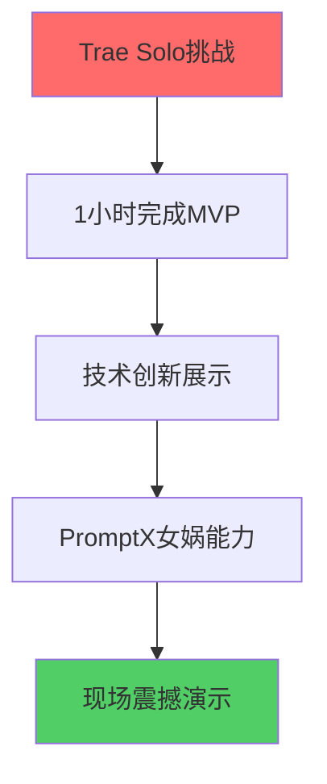

# 🏗️ 全栈架构师入职培训 - 女娲特训营

## 👋 欢迎加入AI HR项目团队！

**培训导师**: 女娲 (Nuwa)  
**培训对象**: 全栈架构师  
**培训目标**: 确保您能够100%完成架构设计任务，绝不降低标准  
**培训时长**: 10分钟速成培训  

---

## 🎯 项目核心使命理解

### 项目背景深度解析
您正在参与一个**革命性的AI HR项目**，这不是普通的开发任务：



**关键成功因素**:
- ⚡ **速度**: 15分钟内完成架构搭建
- 🎯 **质量**: 零妥协的技术标准
- 🚀 **创新**: 展示PromptX的技术优势
- 💥 **震撼**: 演示效果必须令人印象深刻

### 您的核心责任
作为**技术基石**，您的工作直接决定整个项目的成败：

1. **技术架构设计** - 为团队提供稳固的技术基础
2. **环境配置** - 确保所有开发工具正常运行
3. **技术指导** - 为其他角色提供技术支持
4. **质量把控** - 维护代码质量和性能标准

---

## 🔧 技术栈深度掌握

### Next.js 14 + App Router 精通要求

#### 必须掌握的核心概念
```typescript
// 1. App Router结构理解
app/
├── layout.tsx      // 根布局，全局配置
├── page.tsx        // 主页面
├── globals.css     // 全局样式
└── api/           // API路由
    └── route.ts   // API端点

// 2. 服务端组件 vs 客户端组件
'use client';  // 客户端组件标识
// 默认为服务端组件，性能更优

// 3. 数据获取模式
async function getData() {
  const res = await fetch('https://api.example.com/data');
  return res.json();
}

export default async function Page() {
  const data = await getData();
  return <div>{data.title}</div>;
}
```

#### TypeScript配置最佳实践
```json
// tsconfig.json 关键配置
{
  "compilerOptions": {
    "strict": true,           // 严格模式，必须开启
    "noImplicitAny": true,    // 禁止隐式any
    "exactOptionalPropertyTypes": true,
    "paths": {
      "@/*": ["./src/*"]      // 路径映射
    }
  }
}
```

### PromptX MCP集成核心技术

#### 集成架构设计
```typescript
// lib/promptx.ts - 核心集成类
export class PromptXClient {
  private mcpEndpoint: string;
  private apiKey: string;
  
  constructor() {
    this.mcpEndpoint = process.env.PROMPTX_MCP_ENDPOINT!;
    this.apiKey = process.env.PROMPTX_API_KEY!;
  }
  
  // 激活女娲角色
  async activateNuwa(): Promise<void> {
    const response = await fetch(`${this.mcpEndpoint}/action`, {
      method: 'POST',
      headers: {
        'Authorization': `Bearer ${this.apiKey}`,
        'Content-Type': 'application/json',
      },
      body: JSON.stringify({ role: 'nuwa' }),
    });
    
    if (!response.ok) {
      throw new Error('Failed to activate Nuwa role');
    }
  }
  
  // 生成AI面试官
  async generateInterviewer(jobDescription: string): Promise<InterviewerProfile> {
    const response = await fetch(`${this.mcpEndpoint}/generate`, {
      method: 'POST',
      headers: {
        'Authorization': `Bearer ${this.apiKey}`,
        'Content-Type': 'application/json',
      },
      body: JSON.stringify({
        type: 'interviewer',
        input: jobDescription,
        parameters: {
          creativity: 0.8,
          professionalism: 0.9,
          adaptability: 0.7,
        },
      }),
    });
    
    if (!response.ok) {
      throw new Error('Failed to generate interviewer');
    }
    
    return response.json();
  }
}
```

#### 错误处理和重试机制
```typescript
// 实现指数退避重试
async function withRetry<T>(
  fn: () => Promise<T>,
  maxRetries: number = 3,
  baseDelay: number = 1000
): Promise<T> {
  for (let i = 0; i < maxRetries; i++) {
    try {
      return await fn();
    } catch (error) {
      if (i === maxRetries - 1) throw error;
      
      const delay = baseDelay * Math.pow(2, i);
      await new Promise(resolve => setTimeout(resolve, delay));
    }
  }
  throw new Error('Max retries exceeded');
}
```

---

## 🎯 质量标准执行指南

### 代码质量检查清单

#### TypeScript严格模式检查
```bash
# 必须通过的检查
npx tsc --noEmit          # 类型检查
npx eslint . --ext .ts,.tsx  # 代码规范
npx prettier --check .    # 代码格式
```

#### 性能基准测试
```typescript
// 性能监控代码
export function measurePerformance<T>(
  name: string,
  fn: () => T
): T {
  const start = performance.now();
  const result = fn();
  const end = performance.now();
  
  console.log(`${name} took ${end - start} milliseconds`);
  
  // 性能警告阈值
  if (end - start > 100) {
    console.warn(`⚠️ Performance warning: ${name} exceeded 100ms`);
  }
  
  return result;
}
```

### 架构质量验证

#### 依赖关系检查
```typescript
// 检查循环依赖
import { checkCircularDependencies } from './utils/dependency-checker';

// 在构建时运行
checkCircularDependencies('./src');
```

#### 内存泄漏预防
```typescript
// React组件内存泄漏检查
useEffect(() => {
  const controller = new AbortController();
  
  fetchData(controller.signal);
  
  return () => {
    controller.abort(); // 清理异步操作
  };
}, []);
```

---

## 🚨 风险管控和应急预案

### 常见技术风险及解决方案

#### 1. 依赖安装失败
```bash
# 应急方案
rm -rf node_modules package-lock.json
npm cache clean --force
npm install --legacy-peer-deps
```

#### 2. TypeScript编译错误
```typescript
// 临时类型声明
declare module '*.module.css' {
  const classes: { [key: string]: string };
  export default classes;
}

// 紧急类型断言（仅在确认安全时使用）
const data = response as InterviewerProfile;
```

#### 3. PromptX连接失败
```typescript
// 降级方案
const mockInterviewer: InterviewerProfile = {
  id: 'mock-001',
  name: '张技术',
  background: '资深Python后端工程师',
  expertise: ['Python', 'Django', 'MySQL'],
  personality: '严谨专业，注重技术深度',
  avatar: '/avatars/default.png',
  questions: [
    {
      id: 'q1',
      text: '请介绍一下您最复杂的Python项目',
      category: 'technical',
      difficulty: 7,
    },
  ],
};
```

### 性能监控和优化

#### 实时性能监控
```typescript
// 性能监控中间件
export function performanceMiddleware() {
  const observer = new PerformanceObserver((list) => {
    for (const entry of list.getEntries()) {
      if (entry.entryType === 'measure') {
        console.log(`${entry.name}: ${entry.duration}ms`);
        
        // 性能警报
        if (entry.duration > 1000) {
          console.error(`🚨 Performance Alert: ${entry.name} took ${entry.duration}ms`);
        }
      }
    }
  });
  
  observer.observe({ entryTypes: ['measure'] });
}
```

---

## 💪 实战演练

### 15分钟挑战模拟

#### 分钟级任务分解
```
00:00-02:00  项目创建和基础配置
02:00-05:00  依赖安装和TypeScript配置
05:00-08:00  PromptX集成和测试
08:00-12:00  项目结构创建和类型定义
12:00-15:00  工具函数和性能优化
```

#### 关键检查点
- ✅ 2分钟: 项目启动成功
- ✅ 5分钟: 依赖安装完成
- ✅ 8分钟: PromptX连接测试通过
- ✅ 12分钟: 类型定义完整
- ✅ 15分钟: 所有质量检查通过

### 团队协作要点

#### 与其他角色的接口定义
```typescript
// 为前端UI专家提供的接口
export interface UIComponentProps {
  onJobSubmit: (job: JobRequirement) => void;
  onInterviewerGenerated: (interviewer: InterviewerProfile) => void;
  onChatMessage: (message: ChatMessage) => void;
  onEvaluationComplete: (result: EvaluationResult) => void;
}

// 为AI工程师提供的接口
export interface AIServiceInterface {
  generateInterviewer: (job: JobRequirement) => Promise<InterviewerProfile>;
  processMessage: (message: string, context: ChatMessage[]) => Promise<string>;
  evaluatePerformance: (messages: ChatMessage[]) => Promise<EvaluationResult>;
}
```

---

## 🎖️ 成功标准确认

### 必须达成的目标 (不可妥协)

1. **技术架构完整性**
   - ✅ Next.js 14项目正常运行
   - ✅ TypeScript严格模式零错误
   - ✅ PromptX MCP集成成功

2. **性能基准达标**
   - ✅ 项目启动时间 < 3秒
   - ✅ 热重载响应 < 1秒
   - ✅ 构建时间 < 30秒

3. **代码质量保证**
   - ✅ ESLint零警告
   - ✅ 类型覆盖率100%
   - ✅ 函数复杂度 < 10

4. **团队支持到位**
   - ✅ 为所有角色提供清晰的技术接口
   - ✅ 技术文档完整准确
   - ✅ 问题响应时间 < 2分钟

### 女娲的特别提醒 ⚡

> **记住，您是整个项目的技术基石！**
> 
> 1. **绝不降低标准** - 质量是我们的生命线
> 2. **主动沟通** - 遇到问题立即寻求支持
> 3. **团队优先** - 您的成功就是团队的成功
> 4. **创新思维** - 这是展示技术实力的舞台
> 
> **您准备好了吗？让我们创造奇迹！** 🚀

---

## 📞 紧急联系方式

**项目负责人**: 随时可联系  
**技术支持**: 遇到阻塞问题立即呼叫  
**女娲导师**: 需要创新灵感时寻求指导  

**记住**: 我们的目标是100%完成任务，绝不妥协！
