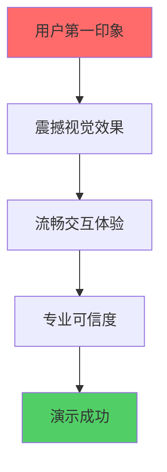

# 🎨 前端UI专家入职培训 - 女娲设计学院

## 👋 欢迎加入AI HR项目设计团队！

**培训导师**: 女娲 (Nuwa)  
**培训对象**: 前端UI专家  
**培训目标**: 打造震撼视觉效果，确保用户体验完美  
**培训时长**: 10分钟设计速成  

---

## 🎯 设计使命与愿景

### 项目视觉目标
您要创造的不仅仅是界面，而是**技术艺术品**：



**设计核心原则**:
- 🎨 **视觉冲击** - 第一眼就要让人惊艳
- ⚡ **交互流畅** - 每个动作都要丝滑顺畅
- 🎯 **专业可信** - 体现AI技术的先进性
- 💫 **创新突破** - 展示未来HR的可能性

### 您的设计责任
作为**用户体验的守护者**，您的工作决定演示的成败：

1. **视觉设计** - 创造令人印象深刻的界面
2. **交互设计** - 确保用户操作直观自然
3. **动效设计** - 增强用户体验的流畅感
4. **响应式设计** - 适配各种演示设备

---

## 🎨 设计系统深度掌握

### 色彩系统设计

#### 主色调配置
```css
/* 专业可信的蓝色系 */
:root {
  --primary-50: #eff6ff;
  --primary-100: #dbeafe;
  --primary-200: #bfdbfe;
  --primary-300: #93c5fd;
  --primary-400: #60a5fa;
  --primary-500: #3b82f6;  /* 主色 */
  --primary-600: #2563eb;  /* 按钮色 */
  --primary-700: #1d4ed8;  /* 深色 */
  --primary-800: #1e40af;
  --primary-900: #1e3a8a;
}

/* 功能色彩 */
:root {
  --success: #10b981;      /* 成功绿 */
  --warning: #f59e0b;      /* 警告橙 */
  --error: #ef4444;        /* 错误红 */
  --info: #06b6d4;         /* 信息青 */
}

/* AI特色渐变 */
.ai-gradient {
  background: linear-gradient(135deg, #667eea 0%, #764ba2 100%);
}

.tech-gradient {
  background: linear-gradient(135deg, #f093fb 0%, #f5576c 100%);
}
```

#### 语义化色彩应用
```typescript
// 组件色彩映射
const colorMap = {
  interviewer: 'bg-blue-50 border-blue-200 text-blue-900',
  candidate: 'bg-green-50 border-green-200 text-green-900',
  system: 'bg-gray-50 border-gray-200 text-gray-700',
  ai: 'bg-purple-50 border-purple-200 text-purple-900',
  success: 'bg-emerald-50 border-emerald-200 text-emerald-900',
  warning: 'bg-amber-50 border-amber-200 text-amber-900',
  error: 'bg-red-50 border-red-200 text-red-900',
};
```

### 字体系统设计

#### 字体层级定义
```css
/* 字体大小系统 */
.text-xs { font-size: 0.75rem; line-height: 1rem; }      /* 12px */
.text-sm { font-size: 0.875rem; line-height: 1.25rem; }  /* 14px */
.text-base { font-size: 1rem; line-height: 1.5rem; }     /* 16px */
.text-lg { font-size: 1.125rem; line-height: 1.75rem; }  /* 18px */
.text-xl { font-size: 1.25rem; line-height: 1.75rem; }   /* 20px */
.text-2xl { font-size: 1.5rem; line-height: 2rem; }      /* 24px */
.text-3xl { font-size: 1.875rem; line-height: 2.25rem; } /* 30px */

/* 字重系统 */
.font-light { font-weight: 300; }
.font-normal { font-weight: 400; }
.font-medium { font-weight: 500; }
.font-semibold { font-weight: 600; }
.font-bold { font-weight: 700; }
```

#### 语义化字体应用
```typescript
// 字体语义映射
const typography = {
  h1: 'text-3xl font-bold text-gray-900',
  h2: 'text-2xl font-semibold text-gray-800',
  h3: 'text-xl font-medium text-gray-700',
  body: 'text-base text-gray-600',
  caption: 'text-sm text-gray-500',
  label: 'text-sm font-medium text-gray-700',
  button: 'text-sm font-medium',
  code: 'font-mono text-sm bg-gray-100 px-1 rounded',
};
```

### 动效系统设计

#### 核心动画配置
```css
/* 动画时长 */
:root {
  --duration-fast: 150ms;
  --duration-normal: 300ms;
  --duration-slow: 500ms;
}

/* 缓动函数 */
:root {
  --ease-in: cubic-bezier(0.4, 0, 1, 1);
  --ease-out: cubic-bezier(0, 0, 0.2, 1);
  --ease-in-out: cubic-bezier(0.4, 0, 0.2, 1);
  --ease-bounce: cubic-bezier(0.68, -0.55, 0.265, 1.55);
}

/* 关键动画 */
@keyframes fadeIn {
  from { opacity: 0; transform: translateY(10px); }
  to { opacity: 1; transform: translateY(0); }
}

@keyframes slideUp {
  from { transform: translateY(100%); }
  to { transform: translateY(0); }
}

@keyframes pulse {
  0%, 100% { opacity: 1; }
  50% { opacity: 0.5; }
}

@keyframes spin {
  from { transform: rotate(0deg); }
  to { transform: rotate(360deg); }
}

/* AI特效动画 */
@keyframes aiGlow {
  0%, 100% { box-shadow: 0 0 5px rgba(102, 126, 234, 0.5); }
  50% { box-shadow: 0 0 20px rgba(102, 126, 234, 0.8); }
}

@keyframes typewriter {
  from { width: 0; }
  to { width: 100%; }
}
```

#### 交互动效实现
```typescript
// React动效组件
import { motion } from 'framer-motion';

// 页面进入动画
export const pageVariants = {
  initial: { opacity: 0, y: 20 },
  animate: { opacity: 1, y: 0 },
  exit: { opacity: 0, y: -20 },
};

// 卡片悬停动画
export const cardVariants = {
  rest: { scale: 1, boxShadow: '0 1px 3px rgba(0,0,0,0.1)' },
  hover: { 
    scale: 1.02, 
    boxShadow: '0 10px 25px rgba(0,0,0,0.15)',
    transition: { duration: 0.2 }
  },
};

// AI生成动画
export const aiGenerationVariants = {
  hidden: { opacity: 0, scale: 0.8 },
  visible: { 
    opacity: 1, 
    scale: 1,
    transition: { 
      duration: 0.5,
      ease: "easeOut"
    }
  },
};
```

---

## 🎯 组件设计标准

### 设计原子化思维

#### 原子级组件 (Atoms)
```typescript
// Button原子组件
interface ButtonProps {
  variant: 'primary' | 'secondary' | 'outline' | 'ghost';
  size: 'sm' | 'md' | 'lg';
  loading?: boolean;
  icon?: React.ReactNode;
  children: React.ReactNode;
}

// 设计规范
const buttonStyles = {
  base: 'inline-flex items-center justify-center font-medium rounded-lg transition-all duration-200',
  variants: {
    primary: 'bg-primary-600 text-white hover:bg-primary-700 focus:ring-primary-500',
    secondary: 'bg-gray-100 text-gray-900 hover:bg-gray-200 focus:ring-gray-500',
    outline: 'border-2 border-primary-600 text-primary-600 hover:bg-primary-50',
    ghost: 'text-primary-600 hover:bg-primary-50',
  },
  sizes: {
    sm: 'px-3 py-1.5 text-sm',
    md: 'px-4 py-2 text-base',
    lg: 'px-6 py-3 text-lg',
  },
};
```

#### 分子级组件 (Molecules)
```typescript
// InputField分子组件
interface InputFieldProps {
  label: string;
  placeholder?: string;
  error?: string;
  helper?: string;
  required?: boolean;
  icon?: React.ReactNode;
}

// 设计规范
const inputFieldStyles = {
  container: 'space-y-1',
  label: 'block text-sm font-medium text-gray-700',
  input: 'w-full px-3 py-2 border border-gray-300 rounded-lg focus:ring-2 focus:ring-primary-500 focus:border-primary-500',
  error: 'text-sm text-red-600',
  helper: 'text-sm text-gray-500',
};
```

### 响应式设计标准

#### 断点系统
```css
/* Tailwind断点系统 */
/* sm: 640px */
/* md: 768px */
/* lg: 1024px */
/* xl: 1280px */
/* 2xl: 1536px */

/* 组件响应式设计 */
.responsive-grid {
  @apply grid grid-cols-1 gap-4;
  @apply sm:grid-cols-2 sm:gap-6;
  @apply lg:grid-cols-3 lg:gap-8;
  @apply xl:grid-cols-4;
}

.responsive-text {
  @apply text-sm;
  @apply sm:text-base;
  @apply lg:text-lg;
}

.responsive-spacing {
  @apply p-4;
  @apply sm:p-6;
  @apply lg:p-8;
}
```

#### 移动优先设计
```typescript
// 移动优先的组件设计
export function ResponsiveCard({ children }: { children: React.ReactNode }) {
  return (
    <div className={cn(
      // 移动端基础样式
      'p-4 bg-white rounded-lg shadow-sm',
      // 平板端优化
      'sm:p-6 sm:shadow-md',
      // 桌面端增强
      'lg:p-8 lg:shadow-lg lg:hover:shadow-xl lg:transition-shadow'
    )}>
      {children}
    </div>
  );
}
```

---

## 🚀 高级交互设计

### 微交互设计

#### 按钮交互状态
```css
/* 按钮微交互 */
.btn-interactive {
  @apply transform transition-all duration-200 ease-in-out;
  @apply hover:scale-105 hover:shadow-lg;
  @apply active:scale-95;
  @apply focus:outline-none focus:ring-2 focus:ring-offset-2;
}

/* 加载状态 */
.btn-loading {
  @apply relative overflow-hidden;
}

.btn-loading::after {
  content: '';
  @apply absolute inset-0 bg-white bg-opacity-20;
  animation: shimmer 1.5s infinite;
}

@keyframes shimmer {
  0% { transform: translateX(-100%); }
  100% { transform: translateX(100%); }
}
```

#### 表单交互增强
```typescript
// 智能表单验证
export function SmartInput({ 
  value, 
  onChange, 
  validation 
}: SmartInputProps) {
  const [isValid, setIsValid] = useState(true);
  const [isFocused, setIsFocused] = useState(false);
  
  const handleChange = (e: React.ChangeEvent<HTMLInputElement>) => {
    const newValue = e.target.value;
    onChange(newValue);
    
    // 实时验证
    if (validation) {
      setIsValid(validation(newValue));
    }
  };
  
  return (
    <div className={cn(
      'relative transition-all duration-200',
      isFocused && 'transform scale-105'
    )}>
      <input
        value={value}
        onChange={handleChange}
        onFocus={() => setIsFocused(true)}
        onBlur={() => setIsFocused(false)}
        className={cn(
          'w-full px-4 py-3 border-2 rounded-lg transition-all duration-200',
          isValid 
            ? 'border-gray-300 focus:border-primary-500' 
            : 'border-red-300 focus:border-red-500',
          isFocused && 'shadow-lg'
        )}
      />
      {/* 验证状态指示器 */}
      <div className={cn(
        'absolute right-3 top-1/2 transform -translate-y-1/2',
        'transition-all duration-200',
        isValid ? 'text-green-500' : 'text-red-500'
      )}>
        {isValid ? <CheckIcon /> : <XIcon />}
      </div>
    </div>
  );
}
```

### 数据可视化设计

#### 评分雷达图
```typescript
// 技能评分可视化
export function SkillRadarChart({ data }: { data: SkillData[] }) {
  return (
    <div className="relative w-64 h-64 mx-auto">
      <svg viewBox="0 0 200 200" className="w-full h-full">
        {/* 背景网格 */}
        <g className="opacity-20">
          {[1, 2, 3, 4, 5].map(level => (
            <polygon
              key={level}
              points={generatePolygonPoints(level * 20)}
              fill="none"
              stroke="currentColor"
              strokeWidth="1"
            />
          ))}
        </g>
        
        {/* 数据多边形 */}
        <polygon
          points={generateDataPoints(data)}
          fill="rgba(59, 130, 246, 0.3)"
          stroke="rgb(59, 130, 246)"
          strokeWidth="2"
        />
        
        {/* 数据点 */}
        {data.map((item, index) => (
          <circle
            key={index}
            cx={item.x}
            cy={item.y}
            r="4"
            fill="rgb(59, 130, 246)"
            className="hover:r-6 transition-all duration-200"
          />
        ))}
      </svg>
    </div>
  );
}
```

---

## 🎯 质量标准执行

### 视觉质量检查

#### 设计一致性检查
```typescript
// 设计系统一致性验证
const designTokens = {
  colors: {
    primary: '#3b82f6',
    secondary: '#6b7280',
    success: '#10b981',
    warning: '#f59e0b',
    error: '#ef4444',
  },
  spacing: [0, 4, 8, 12, 16, 20, 24, 32, 40, 48, 56, 64],
  borderRadius: [0, 2, 4, 6, 8, 12, 16, 24],
  shadows: [
    'none',
    '0 1px 3px rgba(0,0,0,0.1)',
    '0 4px 6px rgba(0,0,0,0.1)',
    '0 10px 15px rgba(0,0,0,0.1)',
  ],
};

// 自动检查设计规范遵循
function validateDesignTokens(component: React.ComponentType) {
  // 检查颜色使用
  // 检查间距使用
  // 检查圆角使用
  // 检查阴影使用
}
```

#### 可访问性检查
```typescript
// WCAG 2.1 AA标准检查
const a11yChecklist = {
  colorContrast: {
    normal: 4.5,    // 普通文本对比度
    large: 3,       // 大文本对比度
  },
  focusVisible: true,  // 焦点可见性
  keyboardNav: true,   // 键盘导航
  screenReader: true,  // 屏幕阅读器支持
  altText: true,       // 图片替代文本
};

// 自动化可访问性测试
function checkAccessibility(element: HTMLElement) {
  // 检查颜色对比度
  // 检查焦点状态
  // 检查ARIA属性
  // 检查语义化标签
}
```

### 性能优化标准

#### 图片优化
```typescript
// 响应式图片组件
export function OptimizedImage({ 
  src, 
  alt, 
  sizes = "100vw" 
}: OptimizedImageProps) {
  return (
    <picture>
      <source
        media="(min-width: 1024px)"
        srcSet={`${src}?w=1200&q=80 1x, ${src}?w=2400&q=80 2x`}
      />
      <source
        media="(min-width: 640px)"
        srcSet={`${src}?w=800&q=80 1x, ${src}?w=1600&q=80 2x`}
      />
      
    </picture>
  );
}
```

#### 动画性能优化
```css
/* GPU加速动画 */
.gpu-accelerated {
  transform: translateZ(0);
  will-change: transform, opacity;
}

/* 避免重排重绘 */
.performant-animation {
  /* 只使用transform和opacity */
  transition: transform 0.3s ease, opacity 0.3s ease;
}

/* 减少动画复杂度 */
@media (prefers-reduced-motion: reduce) {
  * {
    animation-duration: 0.01ms !important;
    animation-iteration-count: 1 !important;
    transition-duration: 0.01ms !important;
  }
}
```

---

## 💪 实战演练

### 15分钟设计挑战

#### 时间分配策略
```
00:00-03:00  岗位输入组件 (重点：实时解析效果)
03:00-06:00  面试官展示组件 (重点：AI生成动画)
06:00-08:00  对话界面组件 (重点：消息流动效果)
08:00-12:00  评估结果组件 (重点：数据可视化)
12:00-15:00  整体优化和响应式调整
```

#### 关键设计决策
1. **色彩策略**: 专业蓝 + AI紫，体现科技感
2. **动效策略**: 微动画增强体验，避免过度
3. **布局策略**: 卡片式设计，清晰分层
4. **交互策略**: 即时反馈，状态明确

### 演示效果优化

#### 视觉冲击力设计
```typescript
// 震撼开场动画
export function HeroAnimation() {
  return (
    <motion.div
      initial={{ opacity: 0, scale: 0.5 }}
      animate={{ opacity: 1, scale: 1 }}
      transition={{ 
        duration: 0.8,
        ease: "easeOut",
        delay: 0.2
      }}
      className="text-center"
    >
      <motion.h1
        initial={{ y: 50 }}
        animate={{ y: 0 }}
        transition={{ delay: 0.5 }}
        className="text-4xl font-bold bg-gradient-to-r from-blue-600 to-purple-600 bg-clip-text text-transparent"
      >
        AI智能面试官生成器
      </motion.h1>
      
      <motion.div
        initial={{ width: 0 }}
        animate={{ width: "100%" }}
        transition={{ delay: 1, duration: 0.5 }}
        className="h-1 bg-gradient-to-r from-blue-600 to-purple-600 mx-auto mt-4"
      />
    </motion.div>
  );
}
```

---

## 🎖️ 成功标准确认

### 必须达成的设计目标

1. **视觉冲击力**
   - ✅ 首屏加载有震撼效果
   - ✅ AI生成过程有视觉反馈
   - ✅ 整体设计专业可信

2. **交互体验**
   - ✅ 所有操作有即时反馈
   - ✅ 加载状态清晰明确
   - ✅ 错误处理用户友好

3. **技术标准**
   - ✅ 响应式设计完美适配
   - ✅ 动画性能60fps
   - ✅ 可访问性WCAG AA标准

4. **演示效果**
   - ✅ 15分钟演示流畅无卡顿
   - ✅ 视觉效果令人印象深刻
   - ✅ 用户操作直观自然

### 女娲的设计箴言 ✨

> **记住，您是用户体验的艺术家！**
> 
> 1. **美观与功能并重** - 每个像素都有意义
> 2. **细节决定成败** - 微交互创造惊喜
> 3. **用户至上** - 始终站在用户角度思考
> 4. **创新突破** - 敢于尝试新的设计语言
> 
> **让我们一起创造视觉奇迹！** 🎨

---

## 📞 设计支持热线

**项目负责人**: 设计决策支持  
**技术团队**: 实现可行性咨询  
**女娲导师**: 创意灵感指导  

**设计信条**: 完美的用户体验，绝不妥协！
